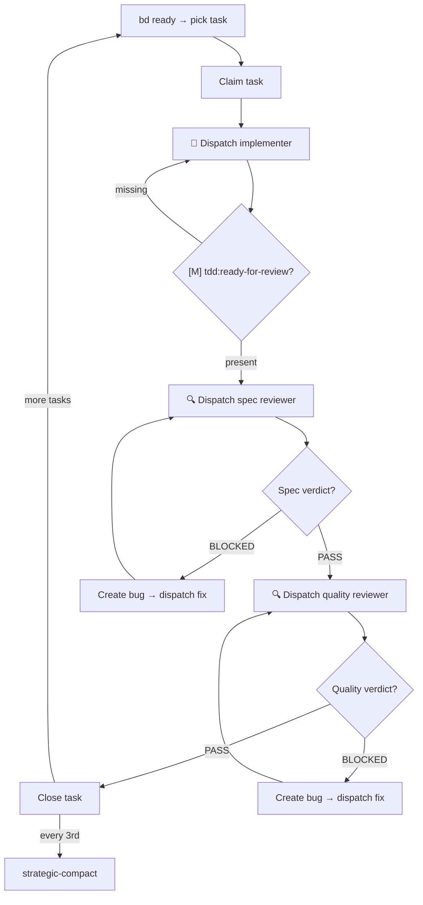

# Claude Workstation

A Claude Code plugin that unifies three powerful systems — **Beads**, **Superpowers**, and **ECC** — into a single, enforced development workflow. One install restores your full dev environment.

## What Problem Does This Solve?

Claude Code is powerful but undisciplined by default. Without structure:
- Tasks get lost between sessions
- Code ships without tests or review
- Subagents run without proper protocol
- Context evaporates on compaction

**Claude Workstation** wires three plugins together with enforcement hooks that **block bad behavior at the tool level** — not with suggestions, but with hard gates that terminate operations when workflow steps are skipped.

## The Stack

```
┌─────────────────────────────────────────────────────┐
│              Claude Workstation Plugin               │
│                                                     │
│  🔒 Hooks ─── 📋 Skills ─── 📄 Protocol Templates  │
└──────┬──────────────┬──────────────┬────────────────┘
       │              │              │
       ▼              ▼              ▼
   ┌────────┐   ┌────────────┐   ┌─────┐
   │ Beads  │   │Superpowers │   │ ECC │
   │ (WHAT) │   │   (HOW)    │   │(WHO)│
   └────────┘   └────────────┘   └─────┘
```

| System | Role | What It Provides |
|--------|------|------------------|
| [**Beads**](https://github.com/steveyegge/beads) | Task tracking | Dolt-powered issue tracker with deps, milestones, persistent state across sessions |
| [**Superpowers**](https://github.com/obra/superpowers-marketplace) | Dev methodology | Brainstorming, planning, TDD, code review, verification, debugging skills |
| [**ECC**](https://github.com/affaan-m/everything-claude-code) | Domain expertise | Language-specific reviewers, build fixers, agents, coding standards |

## The Workflow

Every piece of work follows the same pipeline. No shortcuts, no exceptions.

```
Task → Brainstorm → Plan → Sub-tasks → TDD (red→green→refactor) → Review → Verify → Close
```

**In practice:**

1. **Task** — `bd create --title="Add rate limiting" --type=task`
2. **Brainstorm** — Design before code (produces spec)
3. **Plan** — Decompose into sub-tasks with exact file paths and test code
4. **Sub-tasks** — `bd create` each + wire dependencies with `bd dep add`
5. **TDD** — Write failing test → make it pass → refactor → commit
6. **Review** — Spec compliance first, then code quality
7. **Verify** — Run proof commands, read output, confirm claims
8. **Close** — `bd close <id>` (auto-unblocks dependent tasks)

## Enforcement Hooks

Hooks **block tool calls** when workflow steps are skipped. These aren't warnings — they terminate the operation (`exit 2`).

| Gate | Triggers On | Blocks Unless |
|------|------------|---------------|
| **milestone-gate** | Edit, Write | Active sub-task with `[M] task:claimed` milestone |
| **agent-gate** | Agent dispatch | Prompt includes protocol template or `BEAD-ROLE:default` |
| **commit-gate** | `git commit` | `[M] review:quality` present in task notes |
| **stop-gate** | Session end | All tasks have `[M] verified` or `[M] paused` |
| **mid-session-reminder** | After Edit/Write | *(advisory only)* — echoes current task/phase status |

## TDD Milestone Chain

Each task progresses through a strict milestone sequence. Hooks enforce the chain — you can't skip steps.

```
task:created → task:claimed → tdd:red → tdd:red-verified → tdd:green
  → tdd:green-verified → tdd:refactor → tdd:ready-for-review
  → review:spec → review:quality → verified
```

## Skills

Four on-demand skills, invoked via `/claude-workstation:<name>`:

| Skill | Purpose | Type |
|-------|---------|------|
| [`workflow`](skills/workflow/SKILL.md) | Full workflow reference — hard rules, milestones, deps, Context7, side-quests | On-demand ref |
| [`orchestrator`](skills/orchestrator/SKILL.md) | Automated impl→review→fix cycle per task | Rigid protocol |
| [`task-scaffolder`](skills/task-scaffolder/SKILL.md) | Read a plan file, create beads tasks with dependency graph | Rigid protocol |
| [`agent-roles`](skills/agent-roles/SKILL.md) | Subagent role registry — maps purpose to protocol template | Lookup table |

### Orchestrator

The orchestrator automates TDD → Review → Fix → Close by dispatching subagents in a loop:



### Agent Roles

Every subagent must be equipped with the right protocol before dispatch. The `agent-gate` hook enforces this.

| Role | Template | Use When Agent... |
|------|----------|-------------------|
| **implementer** | `protocol-implementer.md` | Writes or edits code |
| **reviewer** | `protocol-reviewer.md` | Reviews code, logs findings |
| **planner** | `protocol-planner.md` | Creates implementation plans |
| **build-fixer** | `protocol-build-fixer.md` | Fixes build or test errors |
| **default** | *none* — add `BEAD-ROLE:default` | Nothing above matches |

## Installation

### 1. Install Required Plugins

From Claude Code, run `/install-plugin` for each:

| Plugin | Marketplace Name |
|--------|-----------------|
| [Beads](https://github.com/steveyegge/beads) | `beads-marketplace` |
| [Superpowers](https://github.com/obra/superpowers-marketplace) | `superpowers-marketplace` |
| [ECC](https://github.com/affaan-m/everything-claude-code) | `everything-claude-code` |

Optional: [Caveman](https://github.com/JuliusBrussee/caveman) (`caveman`) — token-saving compression modes.

### 2. Install This Plugin

```
/install-plugin claude-workstation
```

### 3. Run Bootstrap Script

```bash
bash install.sh
```

Installs ECC agents/rules (from the locally cached plugin) and the Beads CLI.

### 4. Initialize Beads in Your Project

```bash
bd init
```

## Quick Start

Just tell Claude what you want to build — the workflow activates automatically:

```
You: "build me a rate limiter for the API"
You: "add user authentication"
You: "fix the broken pagination"
You: "refactor the database layer"
```

Claude detects the intent and routes to the right workflow step:

| Intent | What happens |
|--------|-------------|
| New feature / creative work | Creates task → brainstorms → plans → implements with TDD |
| Bug fix | Creates bug → systematic debugging |
| Refactor / cleanup | Creates task → plans scope → implements |
| Planning only | Creates task → brainstorms design |

You can also invoke skills directly:

```bash
/claude-workstation:workflow       # Full workflow reference
/claude-workstation:orchestrator   # Automated impl→review→fix cycle
```

## Project Structure

```
claude-workstation/
├── install.sh                    # Bootstrap ECC + Beads
├── CLAUDE.md                     # Intent detection + workflow routing + agent-roles
├── skills/
│   ├── workflow/SKILL.md         # Full workflow reference
│   ├── orchestrator/SKILL.md     # Automated impl→review→fix cycle
│   ├── task-scaffolder/SKILL.md  # Plan → beads tasks transformer
│   └── agent-roles/SKILL.md     # Subagent role registry
├── templates/
│   ├── protocol-implementer.md   # Implementer subagent protocol
│   ├── protocol-reviewer.md      # Reviewer subagent protocol
│   ├── protocol-planner.md       # Planner subagent protocol
│   ├── protocol-build-fixer.md   # Build-fixer subagent protocol
│   └── protocol-base.md          # Shared protocol base
├── hooks/
│   ├── hooks.json                # Hook event → script wiring
│   ├── milestone-gate            # Blocks Edit/Write without claimed task
│   ├── agent-gate                # Blocks Agent without role sentinel
│   ├── commit-gate               # Blocks git commit without review
│   ├── stop-gate                 # Blocks session end without verification
│   ├── session-start             # Cheatsheet injection + beads auto-init
│   ├── mid-session-reminder      # Echoes task/phase after edits
│   └── ...                       # precompact-state, stop, bd-notes-append
├── tests/
│   ├── validate-config.sh        # 133 config validation checks
│   ├── test-behaviors.sh         # 74 behavioral tests for hooks
│   ├── lib.sh                    # Shared test helpers and utilities
│   └── scenarios/                # Workflow dry-run scripts
└── .claude-plugin/
    ├── plugin.json               # Plugin metadata (v2.7.1)
    └── marketplace.json          # Marketplace listing
```

## License

MIT
